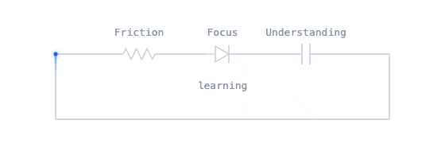
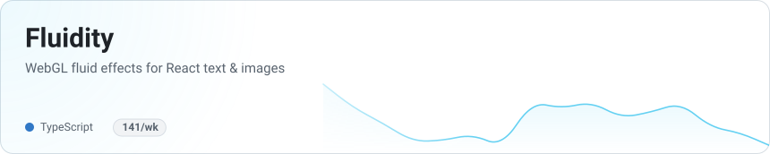
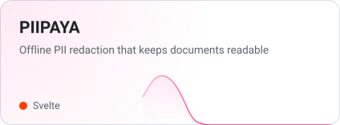
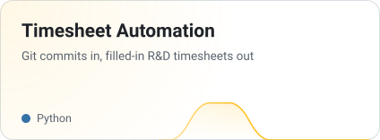
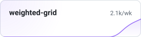
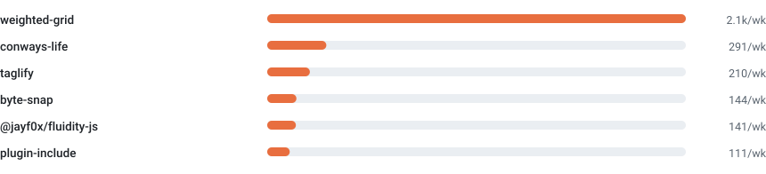

<h1 align="center">Jonatan </h1>

<picture>
  <source media="(prefers-color-scheme: dark)" srcset="./assets/loop-dark.gif" type="image/gif"/>
  <source media="(prefers-color-scheme: light)" srcset="./assets/loop-light.gif" type="image/gif"/>
  
</picture>

<a href="https://jayf0x.github.io/#/contact"><b>jayf0x.github.io</b></a>

---

<!-- SHOWCASE:START -->

<!-- SHOWCASE:END -->

---

<!-- NPM:START -->

<!-- NPM:END -->

<a href="https://jayf0x.github.io/#/127-0-0-1?tag=npm">all packages →</a>

---

<picture>
  <source media="(prefers-color-scheme: dark)" srcset="https://github-readme-activity-graph.vercel.app/graph?username=jayf0x&theme=github-dark&hide_border=true&hide_title=true&area=true&bg_color=transparent"/>
  <source media="(prefers-color-scheme: light)" srcset="https://github-readme-activity-graph.vercel.app/graph?username=jayf0x&theme=github-light&hide_border=true&hide_title=true&area=true&bg_color=transparent"/>
  
</picture>

  <a href="https://jayf0x.github.io/#/resume"><b>📄 Résumé</b></a>
  &nbsp;·&nbsp;
  <a href="https://raw.githubusercontent.com/jayf0x/jayf0x/main/assets/Jonatan-Verstraete-resume-2026.pdf">PDF ↓</a>

